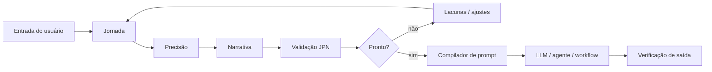
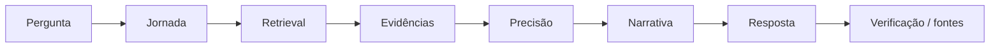

# JPN Framework

**Jornada · Precisão · Narrativa**

[](https://github.com/tiagolif/JPN-Framework/actions/workflows/ci.yml)
[](LICENSE)
[](CHANGELOG.md)
[](docs/SDK.md)

Framework aberto de **engenharia de contexto e prompts** para transformar solicitações ambíguas em estados estruturados, verificáveis e reutilizáveis por modelos de linguagem, agentes de IA, automações e pipelines RAG.

Criado por **Tiago Cunha de Souza**.

> **Status:** `0.3.0-draft`. O JPN possui especificação, JSON Schema e uma implementação de referência em TypeScript. Continua experimental e não reivindica validação científica nem superioridade universal sobre outras técnicas de prompting/context engineering.

---

## O que é o JPN?

O JPN organiza uma tarefa em três dimensões complementares:

- **J — Jornada:** contexto, histórico, estado atual, recursos, restrições e incertezas.
- **P — Precisão:** objetivo operacional, escopo, entradas, saídas, critérios de aceitação, riscos e validação.
- **N — Narrativa:** estado final desejado, sequência de entrega, continuidade e próxima ação.

A proposta é reduzir o **gap entre intenção humana e especificação executável** sem exigir que o usuário escreva prompts extensos ou conheça terminologia técnica.



---

## Por que isso existe?

Solicitações reais raramente chegam como especificações completas. Elas podem conter:

- contexto espalhado em várias mensagens;
- termos informais;
- decisões tomadas anteriormente;
- objetivos implícitos;
- restrições descobertas durante a execução;
- fatos misturados com suposições;
- critérios de sucesso não declarados.

O JPN trata isso como um problema de **engenharia de contexto**.

Em vez de apenas “melhorar um prompt”, a metodologia procura construir um estado que possa ser:

1. inspecionado;
2. validado;
3. versionado;
4. reutilizado;
5. compilado para diferentes agentes ou modelos;
6. comparado com critérios de aceitação.

---

# J — Jornada

A Jornada representa **de onde a tarefa vem**.

Ela captura:

- contexto;
- objetivo de negócio;
- estado atual;
- histórico relevante;
- tentativas anteriores;
- recursos disponíveis;
- restrições conhecidas;
- incertezas;
- itens de contexto com estado de confiança.

Exemplo:

```json
{
  "jornada": {
    "contexto": "Equipe recebe leads pelo WhatsApp.",
    "objetivo_de_negocio": "Reduzir perda de oportunidades.",
    "estado_atual": "Follow-up manual e contexto fragmentado.",
    "incertezas": ["SLA ainda não definido."],
    "itens_de_contexto": [
      {
        "value": "Handoff humano é obrigatório em casos sensíveis.",
        "confidence_state": "confirmed",
        "source": "requisito"
      }
    ]
  }
}
```

### Estados de confiança

O JPN diferencia informação conhecida de informação inferida:

| Estado | Significado |
|---|---|
| `confirmed` | informação confirmada por fonte confiável |
| `inferred` | conclusão razoável, mas ainda não confirmada |
| `unknown` | informação necessária ainda ausente |
| `conflicting` | fontes ou informações entram em conflito |

A regra principal é simples: **inferência não deve ser promovida silenciosamente a fato**.

---

# P — Precisão

Precisão transforma intenção em **contrato operacional**.

Ela descreve:

- objetivo;
- escopo positivo e negativo;
- entradas;
- saídas;
- restrições;
- critérios de aceitação;
- riscos;
- estratégia de validação.

Exemplo:

```json
{
  "precisao": {
    "objetivo": "Qualificar leads e registrar contexto no CRM.",
    "escopo": {
      "inclui": ["qualificação", "registro no CRM"],
      "nao_inclui": ["decisão automática de crédito"]
    },
    "saidas": ["lead qualificado", "resumo de contexto"],
    "criterios_de_aceitacao": [
      "Toda inferência deve ser identificada como inferência."
    ],
    "riscos": ["alucinação de dados comerciais"],
    "validacao": ["executar cenários normais e conflitantes"]
  }
}
```

O objetivo é substituir termos vagos como “faça profissional” por condições que possam ser verificadas.

---

# N — Narrativa

Narrativa define **para onde a execução deve levar**.

No JPN, Narrativa não significa escrever uma história. Ela descreve:

- estado final desejado;
- ordem de entrega;
- formato da resposta;
- nível de detalhe;
- próxima ação;
- continuidade.

Exemplo:

```json
{
  "narrativa": {
    "estado_final_desejado": "Lead qualificado com contexto preservado.",
    "sequencia_de_entrega": [
      "capturar contexto",
      "qualificar",
      "validar",
      "entregar ao responsável"
    ],
    "proxima_acao": "Executar piloto controlado."
  }
}
```

---

# Implementação de referência — TypeScript SDK

A partir da versão `0.3.0-draft`, o JPN deixa de ser somente uma especificação textual e passa a incluir um SDK executável.

### Recursos atuais

- tipos TypeScript para o estado JPN;
- validação runtime usando JSON Schema 2020-12;
- erros de validação estruturados;
- compilador de estado JPN para prompt operacional;
- preservação opcional de estados de confiança no prompt;
- avaliação heurística de prontidão;
- testes automatizados;
- CI com GitHub Actions.

### Estrutura

```text
JPN-Framework/
├── src/
│   ├── index.ts
│   ├── prompt.ts
│   ├── readiness.ts
│   ├── types.ts
│   └── validator.ts
├── schemas/
│   └── jpn.schema.json
├── tests/
│   └── sdk.test.ts
├── examples/
│   └── crm-state.json
├── templates/
├── docs/
│   ├── SDK.md
│   ├── SPECIFICATION.md
│   ├── JPN-RAG.md
│   ├── EVALUATION.md
│   └── ROADMAP.md
└── .github/workflows/ci.yml
```

---

## Executar o SDK

Requer Node.js 20+.

```bash
git clone https://github.com/tiagolif/JPN-Framework.git
cd JPN-Framework
npm install
npm test
npm run build
```

### Validar um estado

```ts
import { validateJpnState } from "./src/index.js";

const result = validateJpnState(input);

if (!result.valid) {
  console.error(result.errors);
}
```

### Gerar um prompt

```ts
import { buildJpnPrompt } from "./src/index.js";

const prompt = buildJpnPrompt(state, {
  includeConfidence: true,
  preamble: "Você é um agente de operações comerciais."
});
```

### Avaliar prontidão

```ts
import { assessJpnReadiness } from "./src/index.js";

const assessment = assessJpnReadiness(state);

if (!assessment.ready) {
  console.log(assessment.gaps);
}
```

Documentação completa: **[docs/SDK.md](docs/SDK.md)**.

---

# JSON Schema

O contrato machine-readable está em:

[`schemas/jpn.schema.json`](schemas/jpn.schema.json)

Ele utiliza JSON Schema Draft 2020-12 e define, entre outros pontos:

- campos obrigatórios;
- campos permitidos;
- tipos;
- estados de confiança;
- estruturas de Jornada, Precisão e Narrativa.

Isso permite usar JPN fora do SDK TypeScript em qualquer linguagem que suporte JSON Schema.

---

# JPN em agentes de IA

Uma arquitetura agentiva pode usar as três camadas assim:

| Camada | Responsabilidade |
|---|---|
| Jornada | memória, contexto, estado, evidência e incerteza |
| Precisão | plano, ferramentas, escopo, políticas, riscos e testes |
| Narrativa | sequência, entrega, continuidade e handoff |

O usuário não precisa enxergar essas etapas. Elas podem existir como estado interno do orquestrador.

---

# JPN-RAG

JPN-RAG aplica a metodologia a sistemas de Retrieval-Augmented Generation.



A ideia é impedir que recuperação de documentos seja tratada como simples “colar contexto no prompt”. Evidência recuperada precisa ter função dentro da tarefa, limites e rastreabilidade.

Veja **[docs/JPN-RAG.md](docs/JPN-RAG.md)**.

---

# Avaliação

O projeto inclui um protocolo inicial para comparar tarefas executadas **com e sem JPN**.

Métricas propostas incluem:

- aderência ao objetivo;
- cumprimento de restrições;
- taxa de alucinação factual;
- completude;
- necessidade de retrabalho;
- consistência de formato;
- rastreabilidade das decisões.

Esse protocolo não é uma prova de superioridade do JPN. Ele existe justamente para que futuras afirmações possam ser testadas em vez de presumidas.

Veja **[docs/EVALUATION.md](docs/EVALUATION.md)**.

---

# Exemplo completo

Um estado JPN estruturado para atendimento comercial e CRM está disponível em:

**[examples/crm-state.json](examples/crm-state.json)**

Há também um estudo explicativo em Markdown dentro da pasta `examples/`.

---

# Documentação

| Documento | Conteúdo |
|---|---|
| [SDK](docs/SDK.md) | API e implementação TypeScript |
| [Specification](docs/SPECIFICATION.md) | contrato conceitual do framework |
| [JPN-RAG](docs/JPN-RAG.md) | extensão para retrieval e conhecimento |
| [Evaluation](docs/EVALUATION.md) | protocolo de benchmark e comparação |
| [Roadmap](docs/ROADMAP.md) | próximos marcos |
| [Contributing](CONTRIBUTING.md) | como contribuir |
| [Changelog](CHANGELOG.md) | histórico de versões |

---

# Princípios do projeto

1. **Contexto não é licença para inventar.**
2. **Fato, inferência, desconhecido e conflito são estados diferentes.**
3. **Escopo negativo é tão importante quanto escopo positivo.**
4. **Critérios de aceitação devem existir antes da conclusão.**
5. **O estado final importa mais do que uma resposta linguisticamente bonita.**
6. **Prompts são artefatos versionáveis, não magia.**
7. **Frameworks devem ser avaliáveis e falsificáveis.**
8. **O núcleo não deve depender de um único provedor de IA.**

---

# Limitações

O JPN não:

- elimina alucinações de modelos de linguagem;
- substitui testes de software;
- substitui revisão humana em decisões críticas;
- garante respostas melhores em toda tarefa;
- interpreta emoções ou estados psicológicos;
- possui validação neurocientífica;
- é um modelo de IA por si só.

O SDK atual também está em estado `draft`; a API pode mudar antes da versão `1.0.0`.

---

# Roadmap resumido

Próximos objetivos técnicos:

- geração automática dos tipos TypeScript a partir do JSON Schema;
- parser de intake para criar rascunhos JPN a partir de entradas brutas;
- adapters opcionais para provedores de LLM;
- benchmark automatizado;
- migração/versionamento de estados JPN;
- pacote npm quando a API estiver suficientemente estável;
- mais estudos de caso reproduzíveis.

Veja **[docs/ROADMAP.md](docs/ROADMAP.md)**.

---

# Licença

MIT License. Veja [`LICENSE`](LICENSE).

A licença permite uso, modificação e distribuição conforme seus termos, preservando o aviso de copyright.

---

## Autor

**Tiago Cunha de Souza**

Criador do JPN Framework — Jornada, Precisão e Narrativa.

> O objetivo do JPN é transformar intenção em contexto estruturado, contexto em especificação verificável e especificação em execução orientada a resultado.
