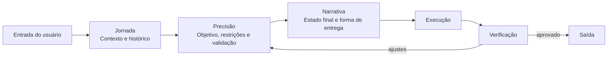
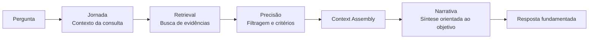

# JPN Framework

**Jornada · Precisão · Narrativa**

Framework aberto para estruturar instruções, contexto e critérios de qualidade em interações com modelos de linguagem, agentes de IA e fluxos com RAG.

Criado por **Tiago Cunha de Souza**.

> **Status:** versão conceitual em evolução. O JPN é uma metodologia de engenharia de contexto e prompts; não é um modelo de IA, não substitui avaliação humana e não reivindica validação neurocientífica.

---

## Visão geral

O **JPN Framework** organiza uma solicitação em três dimensões complementares:

1. **J — Jornada:** de onde o problema vem e em qual contexto ele existe.
2. **P — Precisão:** o que precisa ser feito, sob quais restrições e como verificar se ficou correto.
3. **N — Narrativa:** qual estado final se deseja alcançar e como a resposta deve conduzir a esse resultado.

A proposta é reduzir ambiguidades sem exigir que o usuário escreva prompts longos ou domine terminologia técnica. O framework pode ser aplicado manualmente, embutido em um system prompt, usado por um agente orquestrador ou combinado com RAG.



---

## Problema que o JPN tenta resolver

Solicitações reais raramente chegam como especificações perfeitas. Elas podem conter:

- contexto distribuído em várias mensagens;
- termos informais ou incompletos;
- objetivos implícitos;
- restrições que só aparecem durante a execução;
- conflito entre “o que foi pedido” e “o que realmente resolve o problema”;
- critérios de sucesso não declarados.

O JPN trata esse cenário como um problema de **engenharia de contexto**. A IA deve organizar o pedido sem inventar fatos, distinguir inferência de evidência e transformar intenção em uma especificação executável.

---

# 1. J — Jornada

A **Jornada** descreve o contexto operacional do problema.

Ela responde principalmente:

- Quem está solicitando?
- Qual problema está tentando resolver?
- O que aconteceu antes?
- O que já foi tentado?
- Quais decisões já foram tomadas?
- Quais recursos estão disponíveis?
- Quais restrições são conhecidas?
- O que ainda é incerto?

### Estrutura recomendada

```yaml
jornada:
  contexto: ""
  objetivo_de_negocio: ""
  estado_atual: ""
  historico_relevante: []
  tentativas_anteriores: []
  recursos_disponiveis: []
  restricoes_conhecidas: []
  incertezas: []
```

### Regra fundamental

A Jornada **não autoriza a IA a inventar contexto**. Quando uma informação não está disponível, ela deve ser marcada como hipótese, incerteza ou pergunta pendente.

---

# 2. P — Precisão

A **Precisão** transforma contexto em especificação.

Ela define:

- objetivo operacional;
- escopo;
- requisitos funcionais;
- requisitos não funcionais;
- restrições;
- entradas e saídas;
- formato de resposta;
- critérios de aceitação;
- riscos;
- forma de validação.

### Estrutura recomendada

```yaml
precisao:
  objetivo: ""
  escopo:
    inclui: []
    nao_inclui: []
  entradas: []
  saidas: []
  restricoes: []
  criterios_de_aceitacao: []
  riscos: []
  validacao: []
```

### Critérios de aceitação

Sempre que possível, o JPN recomenda converter adjetivos vagos em critérios verificáveis.

**Fraco:**

> Faça um CRM profissional.

**Melhor:**

> O CRM deve permitir cadastrar leads, movimentá-los entre etapas, registrar interações, pesquisar contatos e preservar isolamento de dados entre empresas.

### QA orientado a risco

Antes de concluir uma tarefa, a camada de Precisão deve verificar:

1. requisitos atendidos;
2. regressões possíveis;
3. dados ausentes;
4. riscos de segurança;
5. compatibilidade com o ambiente existente;
6. critérios de aceitação.

---

# 3. N — Narrativa

No JPN, **Narrativa** não significa contar uma história. Ela representa o **encadeamento entre intenção, execução e estado final desejado**.

Perguntas principais:

- Como deve ser a experiência final?
- Em qual ordem a solução deve ser apresentada ou executada?
- Qual decisão o usuário precisa conseguir tomar depois?
- Qual é a próxima ação útil?
- Como manter continuidade sem perder o contexto anterior?

### Estrutura recomendada

```yaml
narrativa:
  estado_final_desejado: ""
  sequencia_de_entrega: []
  formato_da_resposta: ""
  nivel_de_detalhe: ""
  proxima_acao: ""
  continuidade: []
```

### Exemplo

Pedido inicial:

> “Arruma meu CRM porque o atendimento está confuso.”

**Jornada** identifica o CRM existente, usuários, canais, fluxo atual e problemas observados.

**Precisão** converte isso em itens verificáveis: pipeline, histórico de conversa, permissões, SLA, integração e critérios de teste.

**Narrativa** organiza a execução em uma sequência segura: diagnosticar → corrigir dados → validar fluxo → testar → documentar → indicar próxima melhoria.

---

# Ciclo operacional JPN

Uma implementação completa pode seguir cinco estágios:

## 1. Intake
Receber a solicitação original sem reescrevê-la prematuramente.

## 2. Normalização
Separar fatos, hipóteses, contexto, restrições e lacunas.

## 3. Planejamento
Converter a solicitação em tarefas e critérios de aceitação.

## 4. Execução
Realizar a tarefa respeitando escopo, ferramentas e restrições.

## 5. Verificação
Comparar a saída com os critérios definidos em **Precisão** antes da entrega.

---

# Prompt-base JPN

```text
Use o Framework JPN para estruturar esta tarefa.

J — JORNADA
1. Identifique o contexto confirmado.
2. Separe fatos de hipóteses.
3. Recupere decisões anteriores relevantes.
4. Liste restrições, recursos e lacunas de informação.

P — PRECISÃO
1. Defina o objetivo operacional.
2. Delimite o escopo.
3. Converta requisitos vagos em critérios verificáveis.
4. Identifique riscos e dependências.
5. Defina como a solução será validada.

N — NARRATIVA
1. Defina o estado final desejado.
2. Organize a execução na ordem mais útil e segura.
3. Entregue no formato adequado ao usuário.
4. Termine com a próxima ação relevante, quando houver.

Regras:
- Não invente fatos ausentes.
- Sinalize incertezas.
- Prefira evidência a suposição.
- Preserve decisões já confirmadas.
- Verifique a saída antes de concluir.
```

---

# JPN para agentes de IA

Em sistemas agentivos, JPN pode funcionar como uma camada de orquestração:

| Camada | Responsabilidade |
|---|---|
| Jornada | memória, contexto, estado e intenção |
| Precisão | plano, ferramentas, restrições, testes e políticas |
| Narrativa | sequência, entrega, continuidade e handoff |

Um agente não precisa expor essas etapas ao usuário. Elas podem existir internamente como estado estruturado.

---

# JPN-RAG

**JPN-RAG** aplica os mesmos princípios a sistemas de Retrieval-Augmented Generation.

Fluxo proposto:



Princípios:

- recuperar informação relevante antes de responder;
- separar conteúdo recuperado de inferências;
- preservar origem/proveniência quando disponível;
- evitar preencher lacunas com fatos inventados;
- avaliar suficiência das evidências;
- adaptar a resposta ao objetivo do usuário, sem alterar o sentido da fonte.

A especificação detalhada está em [`docs/JPN-RAG.md`](docs/JPN-RAG.md).

---

# Casos de uso

O JPN pode ser aplicado em:

- agentes de atendimento;
- copilotos internos;
- CRM com IA;
- desenvolvimento assistido por IA;
- análise documental;
- automação de processos;
- geração de conteúdo com requisitos complexos;
- sistemas RAG;
- fluxos multiagente;
- suporte técnico.

---

# Exemplo rápido

### Entrada

> Preciso criar um agente de atendimento para uma loja de móveis.

### JPN resumido

```yaml
jornada:
  contexto: "Atendimento comercial de uma loja de móveis"
  estado_atual: "Atendimento humano"
  incertezas:
    - "canais que serão integrados"
    - "fonte oficial de preços e estoque"

precisao:
  objetivo: "Qualificar clientes e apoiar vendedores sem fornecer informação comercial não validada"
  criterios_de_aceitacao:
    - "registrar lead"
    - "identificar intenção"
    - "preservar histórico"
    - "encaminhar para humano quando necessário"
    - "não inventar preço ou estoque"

narrativa:
  estado_final_desejado: "Cliente atendido e vendedor recebendo um lead contextualizado"
  sequencia_de_entrega:
    - "receber mensagem"
    - "identificar intenção"
    - "consultar conhecimento permitido"
    - "qualificar"
    - "registrar CRM"
    - "realizar handoff quando necessário"
```

---

# Princípios de design

1. **Intenção não é evidência.** Entender o objetivo do usuário não permite inventar fatos.
2. **Contexto deve ser rastreável.** Decisões importantes precisam ter origem identificável.
3. **Restrições são parte da solução.** Uma resposta que ignora limites técnicos ou de negócio não está correta.
4. **Qualidade precisa ser verificável.** Sempre que possível, defina critérios de aceitação.
5. **Continuidade importa.** Uma boa resposta considera o estado anterior e prepara a próxima ação.
6. **Menos ritual, mais utilidade.** O framework deve reduzir carga cognitiva, não criar burocracia.
7. **Humano no controle.** Em decisões de alto impacto, a IA deve apoiar — não substituir — a responsabilidade humana.

---

# Estrutura do repositório

```text
JPN-Framework/
├── README.md
├── LICENSE
├── CHANGELOG.md
├── CONTRIBUTING.md
├── docs/
│   ├── SPECIFICATION.md
│   ├── JPN-RAG.md
│   └── ROADMAP.md
├── examples/
│   └── customer-support.md
└── templates/
    └── JPN_TEMPLATE.md
```

---

# Versão

A documentação passa a adotar versionamento semântico para mudanças conceituais relevantes.

**Versão atual da especificação:** `0.2.0-draft`

O sufixo `draft` indica que o framework ainda está em evolução e precisa de testes comparativos e validação empírica mais ampla.

---

# Autoria e licença

JPN Framework foi idealizado e desenvolvido por **Tiago Cunha de Souza**.

O conteúdo deste repositório é disponibilizado sob a licença **MIT**, conforme o arquivo [`LICENSE`](LICENSE).

A licença MIT permite uso, modificação e distribuição, preservando o aviso de copyright e a licença original.

---

# Como contribuir

Sugestões, exemplos, testes comparativos e melhorias de documentação são bem-vindos. Consulte [`CONTRIBUTING.md`](CONTRIBUTING.md).

---

## English summary

**JPN (Journey, Precision, Narrative)** is an open framework for structuring context, requirements, validation criteria and desired outcomes in LLM prompts, AI agents and RAG workflows. It is designed as a practical context-engineering methodology, not as a claim of neuroscientific modeling.
