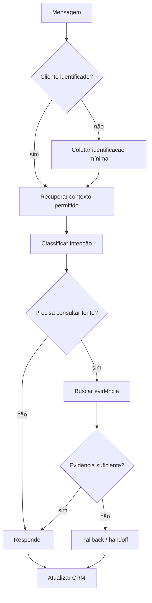

# Exemplo — Agente de Atendimento Comercial

Este exemplo mostra como aplicar JPN a um agente de atendimento sem transformar o framework em um prompt excessivamente longo.

## Cenário

Uma empresa deseja utilizar IA para receber leads, entender a intenção do cliente, registrar informações no CRM e encaminhar oportunidades para vendedores humanos.

## Entrada simples

> “Crie um agente que responda os clientes no WhatsApp e ajude a vender.”

## 1. Jornada

```yaml
jornada:
  contexto: "atendimento comercial por mensageria"
  objetivo_de_negocio: "reduzir perda de leads e acelerar resposta"
  estado_atual: "atendimento majoritariamente humano"
  recursos_disponiveis:
    - "CRM"
    - "base de conhecimento"
    - "canal de atendimento"
  restricoes_conhecidas:
    - "não inventar preço"
    - "não inventar estoque"
    - "permitir handoff humano"
  incertezas:
    - "SLA esperado"
    - "fonte oficial de estoque"
```

## 2. Precisão

```yaml
precisao:
  objetivo: "qualificar o cliente e registrar contexto suficiente para continuidade humana"
  escopo:
    inclui:
      - "identificação da intenção"
      - "coleta de dados essenciais"
      - "respostas baseadas em conhecimento autorizado"
      - "registro no CRM"
      - "handoff"
    nao_inclui:
      - "aprovação financeira"
      - "promessas comerciais não verificadas"
  criterios_de_aceitacao:
    - "cada lead possui identificação e intenção"
    - "histórico relevante é salvo"
    - "informações não verificadas não são apresentadas como fato"
    - "cliente consegue chegar a um humano"
    - "falhas de integração geram fallback"
  riscos:
    - "alucinação de preço"
    - "duplicação de lead"
    - "perda de contexto no handoff"
    - "acesso indevido a dados de outro cliente"
  validacao:
    - "testar lead novo"
    - "testar cliente existente"
    - "testar pergunta sem resposta na base"
    - "testar falha do CRM"
    - "testar solicitação de atendente humano"
```

## 3. Narrativa

```yaml
narrativa:
  estado_final_desejado: "cliente atendido e oportunidade registrada com contexto útil"
  sequencia_de_entrega:
    - "receber mensagem"
    - "identificar cliente"
    - "identificar intenção"
    - "consultar fonte permitida"
    - "responder ou coletar informação"
    - "registrar CRM"
    - "continuar automação ou realizar handoff"
  formato_da_resposta: "conversacional e objetivo"
  proxima_acao: "manter acompanhamento ou entregar ao vendedor"
```

## Fluxo operacional



## Testes mínimos

| Caso | Resultado esperado |
|---|---|
| Cliente pergunta preço sem fonte válida | agente não inventa valor |
| Base não contém resposta | agente informa limite e aciona fallback |
| Cliente pede humano | handoff sem bloquear conversa |
| CRM indisponível | atendimento preserva contexto e sinaliza falha |
| Lead já existente | evitar duplicação quando possível |

## Observação

O JPN não define a tecnologia do canal, CRM ou LLM. Ele organiza requisitos e comportamento. A implementação técnica deve aplicar autenticação, segurança, logging, privacidade e regras específicas do ambiente utilizado.
